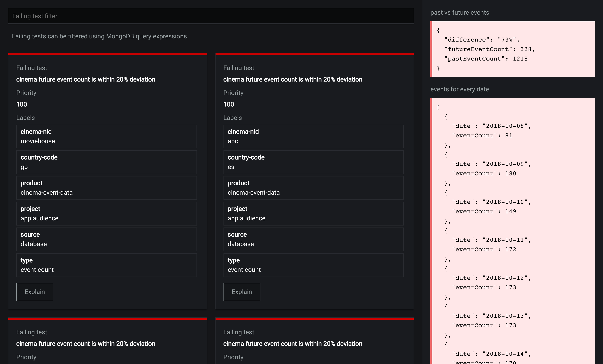

<a name="palantir"></a>
# Palantir

[](https://travis-ci.org/gajus/palantir)
[](https://coveralls.io/github/gajus/palantir)
[](https://www.npmjs.org/package/palantir)
[](https://github.com/gajus/canonical)
[](https://twitter.com/kuizinas)

Active monitoring and alerting system using user-defined Node.js scripts.



<a name="palantir-features"></a>
## Features

* Programmatic test cases (write your own checks using Node.js). (🔥 ready)
* Programmatic troubleshooting (write your own troubleshooting queries for test cases). (🔥 ready)
* Programmatic notifications (write your own mechanism for sending notifications). (🔥 ready)
* Filter tests using MongoDB-like queries. (🔥 ready)
* Track historical health of individual tests. (🗺️ in roadmap)
* Create browser-session specific dashboards. (🗺️ in roadmap)
* Produce charts using troubleshooting output. (🗺️ in roadmap)
* Hosted Palantir instance with tests run using serverless infrastructure, persistent dashboards, integrated timeseries database and notifcations. (💵 commercial) (🗺️ in roadmap)

<a name="palantir-contents"></a>
## Contents

* [Palantir](#palantir)
    * [Features](#palantir-features)
    * [Contents](#palantir-contents)
    * [Motivation](#palantir-motivation)
        * [Further reading](#palantir-motivation-further-reading)
    * [Usage](#palantir-usage)
        * [`monitor` program](#palantir-usage-monitor-program)
        * [`alert` program](#palantir-usage-alert-program)
        * [`report` program](#palantir-usage-report-program)
        * [`test` program](#palantir-usage-test-program)
    * [Specification](#palantir-specification)
        * [Palantir test](#palantir-specification-palantir-test)
        * [Palantir test suite](#palantir-specification-palantir-test-suite)
        * [Monitor configuration](#palantir-specification-monitor-configuration)
        * [Alert configuration](#palantir-specification-alert-configuration)
        * [Alert controller](#palantir-specification-alert-controller)
        * [Palantir HTTP API](#palantir-specification-palantir-http-api)
    * [Recipes](#palantir-recipes)
        * [Asynchronously creating a test suite](#palantir-recipes-asynchronously-creating-a-test-suite)
        * [Refreshing a test suit](#palantir-recipes-refreshing-a-test-suit)
    * [Development](#palantir-development)


<a name="palantir-motivation"></a>
## Motivation

Existing monitoring software primarily focuses on enabling visual inspection of service health metrics and relies on service maintainers to detect anomalies. This approach is time consuming and allows for human-error. Even when monitoring systems allow to define alerts based on pre-defined thresholds, a point-in-time metric is not sufficient to determine service-health. The only way to establish service-health is to write thorough integration tests (scripts) and automate their execution, just like we do in software-development.

Palantir continuously performs user-defined tests and only reports failing tests, i.e. if everything is working as expected, the system remains silent. This allows service developers/maintainers to focus on defining tests that warn about the errors that are about to occur and automate troubleshooting.

Palantir decouples monitoring, alerting and reporting mechanisms. This method allows distributed monitoring and role-based, tag-based alerting system architecture.

<a name="palantir-motivation-further-reading"></a>
### Further reading

* [Ensuring good service health by automating thorough integration testing and alerting](https://medium.com/@gajus/d507572a2618)

<a name="palantir-usage"></a>
## Usage

<a name="palantir-usage-monitor-program"></a>
### <code>monitor</code> program

`monitor` program continuously performs user-defined tests and exposes the current state via [Palantir HTTP API](#palantir-http-api).

```bash
$ palantir monitor --service-port 8080 --configuration ./monitor-configuration.js ./tests/**/*

```

Every test file must export a function that creates a `TestSuiteType` (see [Palantir test suite](#palantir-test-suite)).

* Refer to [Palantir test](#palantir-test) specification.
* Refer to [Monitor configuration](#monitor-configuration) specification.

<a name="palantir-usage-alert-program"></a>
### <code>alert</code> program

`alert` program subscribes to [Palantir HTTP API](#palantir-http-api) and alerts other systems using user-defined configuration.

```bash
$ palantir alert --configuration ./alert-configuration.js --api-url http://127.0.0.1:8080/

```

* Refer to [Alert configuration](#alert-configuration) specification.

<a name="palantir-usage-report-program"></a>
### <code>report</code> program

`report` program creates a web UI for the [Palantir HTTP API](#palantir-http-api).

```bash
$ palantir report --service-port 8081 --api-url http://127.0.0.1:8080/

```

<a name="palantir-usage-test-program"></a>
### <code>test</code> program

`test` program runs tests once.

```bash
$ palantir test --configuration ./monitor-configuration.js ./tests/**/*

```

`test` program is used for test development. It allows to filter tests by description (`--match-description`) and by the test tags (`--match-tag`), e.g.

```bash
$ palantir test --match-description 'event count is greater' --configuration ./monitor-configuration.js ./tests/**/*
$ palantir test --match-tag 'database' --configuration ./monitor-configuration.js ./tests/**/*

```

<a name="palantir-specification"></a>
## Specification

<a name="palantir-specification-palantir-test"></a>
### Palantir test

Palantir test is an object with the following properties:

```js
/**
 * @property assert Evaluates user defined script. The result (boolean) indicates if test is passing.
 * @property configuration User defined configuration accessible by the `beforeTest`.
 * @property explain Provides debugging information about the test.
 * @property interval A function that describes the time when the test needs to be re-run.
 * @property labels Arbitrary key=value labels used to categorise the tests.
 * @property name Unique name of the test. A combination of test + labels must be unique across all test suites.
 * @property priority A numeric value (0-100) indicating the importance of the test. Low value indicates high priority.
 */
type TestType = {|
  +assert: (context: TestContextType) => Promise<boolean>,
  +configuration?: SerializableObjectType,
  +explain?: (context: TestContextType) => Promise<$ReadOnlyArray<ExplanationType>>,
  +interval: (consecutiveFailureCount: number) => number,
  +labels: LabelsType,
  +name: string,
  +priority: number
|};

```

In practice, an example of a test used to check whether HTTP resource is available could look like this:

```js
{
  assert: async () => {
    await request('https://applaudience.com/', {
      timeout: interval('10 seconds')
    });
  },
  interval: () => {
    return interval('30 seconds');
  },
  labels: {
    project: 'applaudience',
    source: 'http',
    type: 'liveness-check'
  },
  name: 'https://applaudience.com/ responds with 200'
}

```

<a name="palantir-specification-palantir-test-suite"></a>
### Palantir test suite

`monitor` program requires a list of file paths as an input. Every input file must export a function that creates a `TestSuiteType` object:

```js
type TestSuiteType = {|
  +tests: $ReadOnlyArray<TestType>
|};

```

Example:

```js
// @flow

import request from 'axios';
import interval from 'human-interval';
import type {
  TestSuiteFactoryType
} from 'palantir';

const createIntervalCreator = (intervalTime) => {
  return () => {
    return intervalTime;
  };
};

const createTestSuite: TestSuiteFactoryType = () => {
  return {
    tests: [
      {
        assert: async () => {
          await request('https://applaudience.com/', {
            timeout: interval('10 seconds')
          });
        },
        interval: createIntervalCreator(interval('30 seconds')),
        labels: {
          project: 'applaudience',
          scope: 'http'
        },
        name: 'https://applaudience.com/ responds with 200'
      }
    ]
  }
};

export default createTestSuite;

```

Note that the test suite factory may return a promise. Refer to [asynchronously creating a test suite](#asynchronously-creating-a-test-suite) for a use case example.

<a name="palantir-specification-monitor-configuration"></a>
### Monitor configuration

Palantir `monitor` program accepts `configuration` configuration (a path to a script).

```js
/**
 * @property after Called when shutting down the monitor.
 * @property afterTest Called after every test.
 * @property before Called when starting the monitor.
 * @property beforeTest Called before every test.
 */
type ConfigurationType = {|
  +after: () => Promise<void>,
  +afterTest?: (test: RegisteredTestType, context?: TestContextType) => Promise<void>,
  +before: () => Promise<void>,
  +beforeTest?: (test: RegisteredTestType) => Promise<TestContextType>
|};

```

The configuration script allows to setup hooks for different stages of the program execution.

In practice, this can be used to configure the database connection, e.g.

```js
import {
  createPool
} from 'slonik';

let pool;

export default {
  afterTest: async (test, context) => {
    await context.connection.release();
  },
  before: async () => {
    pool = await createPool('postgres://');
  },
  beforeTest: async () => {
    const connection = await pool.connect();

    return {
      connection
    };
  }
};

```

Note that in the above example, unless you are using database connection for all the tests, you do not want to allocate a connection for every test. You can restrict allocation of connection using test configuration, e.g.

Test that requires connection to the database:

```js
{
  assert: (context) => {
    return context.connection.any('SELECT 1');
  },
  configuration: {
    database: true
  },
  interval: () => {
    return interval('30 seconds');
  },
  labels: {
    scope: 'database'
  },
  name: 'connects to the database'
}

```

Monitor configuration that is aware of the `configuration.database` configuration.

```js
import {
  createPool
} from 'slonik';

let pool;

export default {
  afterTest: async (test, context) => {
    if (!test.configuration.database) {
      return;
    }

    await context.connection.release();
  },
  before: async () => {
    pool = await createPool('postgres://');
  },
  beforeTest: async (test) => {
    if (!test.configuration.database) {
      return {};
    }

    const connection = await pool.connect();

    return {
      connection
    };
  }
};

```

<a name="palantir-specification-alert-configuration"></a>
### Alert configuration

Palantir `alert` program accepts `configuration` configuration (a path to a script).

```js
/**
 * @property onNewFailingTest Called when a new test fails.
 * @property onRecoveredTest Called when a previously failing test is no longer failing.
 */
type AlertConfigurationType = {|
  +onNewFailingTest?: (registeredTest: RegisteredTestType) => void,
  +onRecoveredTest?: (registeredTest: RegisteredTestType) => void
|};

```

The alert configuration script allows to setup event handlers used to observe when tests fail and recover.

In practice, this can be used to configure a system that notifies other systems about the failing tests, e.g.

```js
/**
 * @file Using https://www.twilio.com/ to send a text message when tests fail and when tests recover.
 */
import createTwilio from 'twilio';

const twilio = createTwilio('ACCOUNT SID', 'AUTH TOKEN');

const sendMessage = (message) => {
  twilio.messages.create({
    body: message,
    to: '+12345678901',
    from: '+12345678901'
  });
};

export default {
  onNewFailingTest: (test) => {
    sendMessage('FAILURE ' + test.name + ' failed');
  },
  onRecoveredTest: (test) => {
    sendMessage('RECOVERY ' + test.name + ' recovered');
  }
};

```

The above example will send a message for every failure and recovery, every time failure/ recovery occurs. In practise, it is desired that the alerting system includes a mechanism to filter out temporarily failures. To address this requirement, Palantir implements an [alert controller](#alert-controller).

<a name="palantir-specification-alert-controller"></a>
### Alert controller

Palantir alert controller abstracts logic used to filter temporarily failures.

`palantir` module exports a factory method `createAlertController` used to create an Palantir alert controller.

```js
/**
 * @property delayFailure Returns test-specific number of milliseconds to wait before considering the test to be failing.
 * @property delayRecovery Returns test-specific number of milliseconds to wait before considering the test to be recovered.
 * @property onFailure Called when test is considered to be failing.
 * @property onRecovery Called when test is considered to be recovered.
 */
type ConfigurationType = {|
  +delayFailure: (test: RegisteredTestType) => number,
  +delayRecovery: (test: RegisteredTestType) => number,
  +onFailure: (test: RegisteredTestType) => void,
  +onRecovery: (test: RegisteredTestType) => void
|};

type AlertControllerType = {|
  +getDelayedFailingTests: () => $ReadOnlyArray<RegisteredTestType>,
  +getDelayedRecoveringTests: () => $ReadOnlyArray<RegisteredTestType>,
  +registerTestFailure: (test: RegisteredTestType) => void,
  +registerTestRecovery: (test: RegisteredTestType) => void
|};

createAlertController(configuration: ConfigurationType) => AlertControllerType;

```

Use `createAlertController` to implement alert throttling, e.g.

```js
import interval from 'human-interval';
import createTwilio from 'twilio';
import {
  createAlertController
} from 'palantir';

const twilio = createTwilio('ACCOUNT SID', 'AUTH TOKEN');

const sendMessage = (message) => {
  twilio.messages.create({
    body: message,
    to: '+12345678901',
    from: '+12345678901'
  });
};

const controller = createAlertController({
  delayFailure: (test) => {
    if (test.labels.scope === 'database') {
      return 0;
    }

    return interval('5 minute');
  },
  delayRecovery: () => {
    return interval('1 minute');
  },
  onFailure: (test) => {
    sendMessage('FAILURE ' + test.description + ' failed');
  },
  onRecovery: () => {
    sendMessage('RECOVERY ' + test.description + ' recovered');
  }
});

export default {
  onNewFailingTest: (test) => {
    controller.registerTestFailure(test);
  },
  onRecoveredTest: (test) => {
    controller.registerTestRecovery(test);
  }
};

```

<a name="palantir-specification-palantir-http-api"></a>
### Palantir HTTP API

Palantir `monitor` program creates HTTP GraphQL API server. The API exposes information about the user-registered tests and the failing tests.

Refer to the [schema.graphql](./src/schema.graphql) or [introspect the API](https://graphql.org/learn/introspection/) to learn more.

<a name="palantir-recipes"></a>
## Recipes

<a name="palantir-recipes-asynchronously-creating-a-test-suite"></a>
### Asynchronously creating a test suite

Creating a test suite might require to query an asynchronous source, e.g. when information required to create a test suite is stored in a database. In this case, a test suite factory can return a promise that resolves with a test suite, e.g.

```js
const createTestSuite: TestSuiteFactoryType = async () => {
  const clients = await getClients(connection);

  return clients.map((client) => {
    return {
      assert: async () => {
        await request(client.url, {
          timeout: interval('10 seconds')
        });
      },
      interval: createIntervalCreator(interval('30 seconds')),
      labels: {
        'client.country': client.country,
        'client.id': client.id,
        source: 'http',
        type: 'liveness-check'
      },
      name: client.url + ' responds with 200'
    };
  });
};

```

In the above example, `getClients` is used to asynchronously retrieve information required to construct the test suite.

<a name="palantir-recipes-refreshing-a-test-suit"></a>
### Refreshing a test suit

It might be desired that the test suite itself informs the monitor about new tests, e.g. the example in the [asynchronously creating a test suite](#asynchronously-creating-a-test-suite) recipe retrieves information from an external datasource that may change over time. In this case, a test suite factory can inform the `monitor` program that it should recreate the test suite, e.g.

```js
const createTestSuite: TestSuiteFactoryType = async (refreshTestSuite) => {
  const clients = await getClients(connection);

  (async () => {
    // Some logic used to determine when the `clients` data used
    // to construct the original test suite becomes stale.
    while (true) {
      await delay(interval('10 seconds'));

      if (JSON.stringify(clients) !== JSON.stringify(await getClients(connection))) {
        // Calling `refreshTestSuite` will make Palantir monitor program
        // recreate the test suite using `createTestSuite`.
        refreshTestSuite();

        break;
      }
    }
  })();

  return clients.map((client) => {
    return {
      assert: async () => {
        await request(client.url, {
          timeout: interval('10 seconds')
        });
      },
      interval: createIntervalCreator(interval('30 seconds')),
      labels: {
        'client.country': client.country,
        'client.id': client.id,
        source: 'http',
        type: 'liveness-check'
      },
      name: client.url + ' responds with 200'
    };
  });
};

```


<a name="palantir-development"></a>
## Development

There are multiple components required to run the service.

Run `npm run dev` to watch the project and re-build upon detecting a change.

In order to observe project changes and restart all the services use a program such as [`nodemon`](https://www.npmjs.com/package/nodemon), e.g.

```bash
$ NODE_ENV=development nodemon --watch dist --ext js,graphql dist/bin/index.js monitor ...
$ NODE_ENV=development nodemon --watch dist --ext js,graphql dist/bin/index.js alert ...

```

Use `--watch` attribute multiple times to include Palantir project code and your configuration/ test scripts.

`report` program run in `NODE_ENV=development` use `webpack-hot-middleware` to implement hot reloading.

```bash
$ NODE_ENV=development babel-node src/bin/index.js report --service-port 8081 --api-url http://127.0.0.1:8080/ | roarr pretty-print

```
